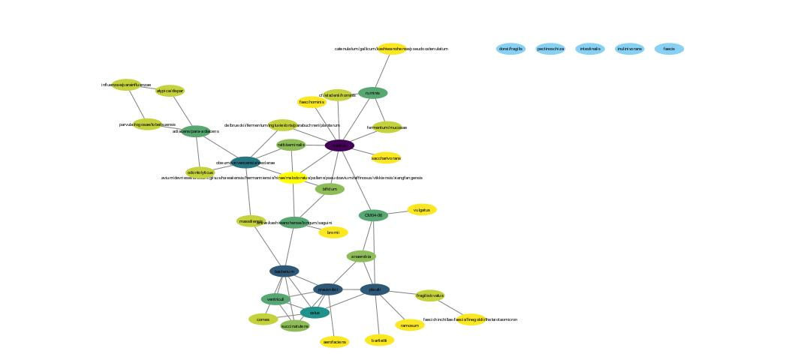

```{r setup, include=FALSE}
knitr::opts_chunk$set(echo = TRUE)
```

## Introducción

El termino hace referencia a todas las especies microbianas que no han sido caracterizadas.Impiden la caracterización de ecosistemas dominados por estos microorganismos, debido a la falta de entendimiento de sus funciones.

## Redes tomando en cuenta los datos de todas las muestras.

### Librerías utilizadas:

```{r message=FALSE, warning=FALSE}
library(igraph)
library(igraphdata)
library(networkD3)
library(RCy3)
library(tidyverse)  
library(microbiomeDataSets)
library(mia)
library(phyloseq)
library(SpiecEasi)
library(ggplot2)
library(tidyr)

```

### Datos a utilizar de "library(microbiomeDataSets)":

```{r message=FALSE, warning=FALSE}
datos_sprockett <- SprockettTHData()

ncol(datos_sprockett)

```

### Proceso para construir el objeto phyloseq:

```{r message=FALSE, warning=FALSE}
matriz_otu <- assays(datos_sprockett)$counts %>% as.matrix()
matriz_tax <- rowData(datos_sprockett) %>% as.data.frame() %>% as.matrix()
datos_muestras <- colData(datos_sprockett) %>% as.data.frame()

OTU <- otu_table(matriz_otu, taxa_are_rows = TRUE)
TAX <- tax_table(matriz_tax)
MUESTRAS <- sample_data(datos_muestras)
physeq <- phyloseq(OTU, TAX, MUESTRAS)
```

### Separacion de objetos con y sin materia obscura:

```{r message=FALSE, warning=FALSE}
physeq_especie <- tax_glom(physeq, taxrank = "Species", NArm = FALSE)

physeq_conocido <- subset_taxa(physeq_especie, !is.na(Species))  # sin materia obscura
physeq_todos <- physeq_especie  # con materia obscura

```

### Filtrado por prevalencia (en este caso tomamos un filtrado del 10%, para obtener una red más densa):

```{r message=FALSE, warning=FALSE}
filtrar_prevalencia <- function(physeq_objeto, umbral = 0.1) {
  prevalencia <- apply(otu_table(physeq_objeto), 1, function(x) mean(x > 0))
  conservar <- names(prevalencia[prevalencia >= umbral])
  prune_taxa(conservar, physeq_objeto)
}

physeq_conocido_filtrado <- filtrar_prevalencia(physeq_conocido, 0.1)
physeq_todos_filtrado    <- filtrar_prevalencia(physeq_todos, 0.1)

```

### Renombramiento de especies para una red con mejor visualización e idenificación de NA's:

```{r message=FALSE, warning=FALSE}
renombrar_especies <- function(physeq_objeto) {
  tax <- tax_table(physeq_objeto)
  especies <- as.character(tax[, "Species"])
  
  especies_limpias <- ifelse(is.na(especies), "Desconocido", especies)
  
  nombres_unicos <- make.unique(especies_limpias)
  
  taxa_names(physeq_objeto) <- nombres_unicos
  return(physeq_objeto)
}

physeq_conocido_filtrado <- renombrar_especies(physeq_conocido_filtrado)
physeq_todos_filtrado    <- renombrar_especies(physeq_todos_filtrado)
```

### Construcción de redes con SPIEC-EASI que utiliza el método de co-ocurrencia:

```{r message=FALSE, warning=FALSE}
red_conocido <- spiec.easi(
  physeq_conocido_filtrado,
  method = "mb",
  lambda.min.ratio = 1e-1,
  nlambda = 20,
  sel.criterion = "bstars",
  pulsar.params = list(thresh = 0.1)
)

red_todos <- spiec.easi(
  physeq_todos_filtrado,
  method = "mb",
  lambda.min.ratio = 1e-1,
  nlambda = 20,
  sel.criterion = "bstars",
  pulsar.params = list(thresh = 0.1)
)
```

### Transfromación a formato Igraph:

```{r message=FALSE, warning=FALSE}
g_conocido <- adj2igraph(getRefit(red_conocido), vertex.attr = list(name = taxa_names(physeq_conocido_filtrado)))
g_todos    <- adj2igraph(getRefit(red_todos),    vertex.attr = list(name = taxa_names(physeq_todos_filtrado)))

```

### Cálculo de métricas de centralidad:

```{r message=FALSE, warning=FALSE}
calcular_metricas <- function(grafo) {
  list(
    nodos = vcount(grafo),
    aristas = ecount(grafo),
    grado_medio = mean(degree(grafo)),
    densidad = edge_density(grafo),
    clustering = transitivity(grafo, type = "global"),
    modularidad = modularity(cluster_louvain(grafo)),
    betweenness_media = mean(betweenness(grafo))
  )
}

metricas_conocido <- calcular_metricas(g_conocido)
metricas_todos    <- calcular_metricas(g_todos)
```

### Tabla comparativa de metricas de centralidad:

```{r warning=FALSE}
tabla_comparativa <- tibble(
  Métrica              = names(metricas_todos),
  Con_materia_obscura  = unlist(metricas_todos),
  Sin_materia_obscura  = unlist(metricas_conocido)
)
print(tabla_comparativa)
```

### Observación de redes:

```{r warning=FALSE}
plot(g_todos,
     vertex.size = degree(g_todos)*2,
     vertex.color = cluster_louvain(g_todos)$membership,
     vertex.label.cex = 0.7,
     edge.width = 1,
     main = "Red con Materia Obscura")

plot(g_conocido,
     vertex.size = degree(g_conocido)*2,
     vertex.color = cluster_louvain(g_conocido)$membership,
     vertex.label.cex = 0.7,
     edge.width = 1,
     main = "Red sin Materia Obscura")

```

### Edición de las redes en Cytoscape para poder visualizarlas de mejor manera:


## **Redes sin taxones aleatorios**

```{r}

# creamos una función para eliminar un porcentaje aleatorio de taxones
eliminar_taxones_azar <- function(physeq, porcentaje = 0.3) {
  # extraemos los nombres de taxones
  taxones <- taxa_names(physeq)
  
  # Seleccionar 30% de taxones al azar
  eliminar <- sample(taxones, size = round(length(taxones) * porcentaje))
  
  # filtrar el phyloseq sin esos taxones
  prune_taxa(setdiff(taxones, eliminar), physeq)
}


#una vez echa la funcion la aplicamos para eliminar 30% de taxones

physeq_reducido <- eliminar_taxones_azar(physeq_conocido_filtrado)

# filtrado de prevalencia en la nueva red
physeq_reducido_filt <- prevalence_filter(physeq_reducido, 0.1)

# hacemos la red con el mismo SPIEC-EASI pero con el phyloseq reducido
se_reducido <- spiec.easi(
  physeq_reducido_filt,
  method = "mb",
  lambda.min.ratio = 1e-1,
  nlambda = 20,
  sel.criterion = "bstars",
  pulsar.params = list(thresh = 0.1)
)

# convertimos a objeto igraph
g_reducido <- adj2igraph(getRefit(se_reducido), vertex.attr = list(name = taxa_names(physeq_reducido_filt)))

# se alcular métricas de la nueva red
m_reducido <- metricas(g_reducido)

# Visualización de la red reducida
plot(g_reducido,
     vertex.size = degree(g_reducido)*2,
     vertex.color = cluster_louvain(g_reducido)$membership,
     vertex.label.cex = 0.7,
     edge.width = 1,
     main = "Red con 30% de taxones eliminados")

# Crear red en Cytoscape pa verla más bonita 
createNetworkFromIgraph(g_reducido, title = "Red con 30% de taxones eliminados")

```

### **Edición de la red** 



### **Tabla comparativa** 

```{r}


# primera creaamos  una tabla comparativa con los datos de las tres redes
tabla_comparativa_especie <- tibble(
  Métrica = names(metricas_all),
  Con_materia_obscura = unlist(m_all),
  Sin_materia_obscura = unlist(m_known),
  Bootstrap = unlist(m_reducido)  
)

tabla_comparativa_especie
```

**Comparación de métricas en gráfica**

```{r}
# convertir en  formato largo para ggplot
df_metricas_especie <- tabla_comparativa_especie %>%
  pivot_longer(cols = -Métrica, names_to = "Red", values_to = "Valor")

# grafica de metricas
ggplot(df_metricas_especie, aes(x = Métrica, y = Valor, fill = Red)) +
  geom_bar(stat = "identity", position = "dodge", color = "black") +  #
  scale_fill_manual(values = c("Con_materia_obscura" = "lightblue", 
                               "Sin_materia_obscura" = "pink", 
                               "Bootstrap" = "purple")) +  # colores para cada red
  theme_minimal() +
  coord_flip()+
  labs(title = "Comparación de métricas entre redes",
       x = "Métrica",
       y = "Valor de métrica") +
  theme(axis.text.x = element_text(angle = 45, hjust = 1))


```
