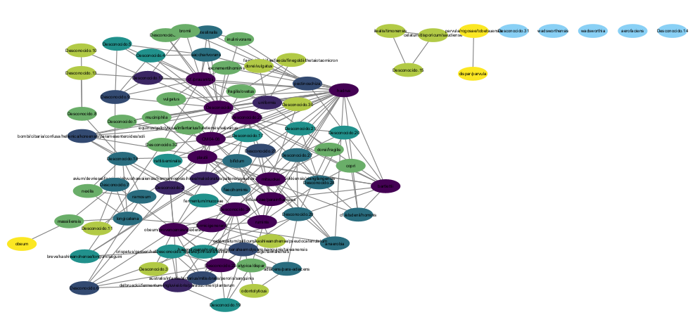
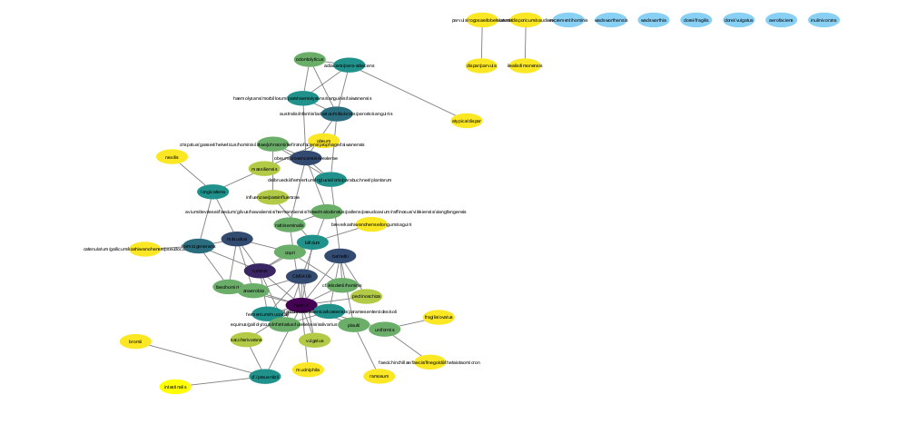
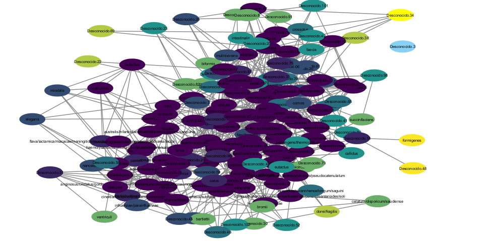
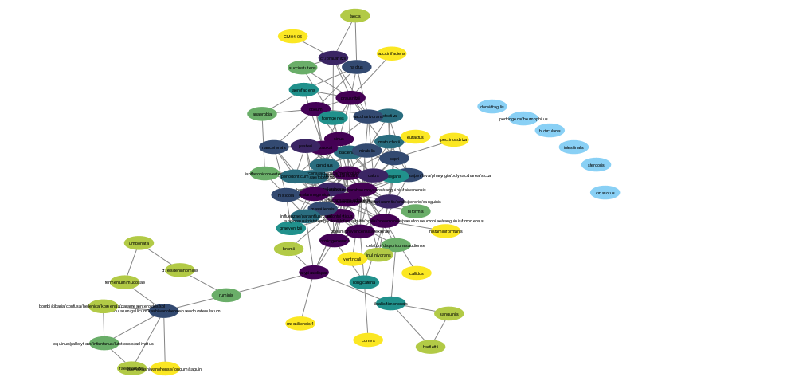

```{r setup, include=FALSE}
knitr::opts_chunk$set(echo = TRUE)
```

## Introducción

El termino hace referencia a todas las especies microbianas que no han sido caracterizadas.Impiden la caracterización de ecosistemas dominados por estos microorganismos, debido a la falta de entendimiento de sus funciones.

## Redes tomando en cuenta los datos de todas las muestras.

### Librerías utilizadas:

```{r message=FALSE, warning=FALSE}
library(igraph)
library(igraphdata)
library(networkD3)
library(RCy3)
library(tidyverse)  
library(microbiomeDataSets)
library(mia)
library(phyloseq)
library(SpiecEasi)
library(ggplot2)
library(tidyr)

```

### Datos a utilizar de "library(microbiomeDataSets)":

```{r message=FALSE, warning=FALSE}
datos_sprockett <- SprockettTHData()

ncol(datos_sprockett)

```

### Proceso para construir el objeto phyloseq:

```{r message=FALSE, warning=FALSE}
matriz_otu <- assays(datos_sprockett)$counts %>% as.matrix()
matriz_tax <- rowData(datos_sprockett) %>% as.data.frame() %>% as.matrix()
datos_muestras <- colData(datos_sprockett) %>% as.data.frame()

OTU <- otu_table(matriz_otu, taxa_are_rows = TRUE)
TAX <- tax_table(matriz_tax)
MUESTRAS <- sample_data(datos_muestras)
physeq <- phyloseq(OTU, TAX, MUESTRAS)
```

### Separacion de objetos con y sin materia obscura:

```{r message=FALSE, warning=FALSE}
physeq_especie <- tax_glom(physeq, taxrank = "Species", NArm = FALSE)

physeq_conocido <- subset_taxa(physeq_especie, !is.na(Species))  # sin materia obscura
physeq_todos <- physeq_especie  # con materia obscura

```

### Filtrado por prevalencia (en este caso tomamos un filtrado del 10%, para obtener una red más densa):

```{r message=FALSE, warning=FALSE}
filtrar_prevalencia <- function(physeq_objeto, umbral = 0.1) {
  prevalencia <- apply(otu_table(physeq_objeto), 1, function(x) mean(x > 0))
  conservar <- names(prevalencia[prevalencia >= umbral])
  prune_taxa(conservar, physeq_objeto)
}

physeq_conocido_filtrado <- filtrar_prevalencia(physeq_conocido, 0.1)
physeq_todos_filtrado    <- filtrar_prevalencia(physeq_todos, 0.1)

```

### Renombramiento de especies para una red con mejor visualización e idenificación de NA's:

```{r message=FALSE, warning=FALSE}
renombrar_especies <- function(physeq_objeto) {
  tax <- tax_table(physeq_objeto)
  especies <- as.character(tax[, "Species"])
  
  especies_limpias <- ifelse(is.na(especies), "Desconocido", especies)
  
  nombres_unicos <- make.unique(especies_limpias)
  
  taxa_names(physeq_objeto) <- nombres_unicos
  return(physeq_objeto)
}

physeq_conocido_filtrado <- renombrar_especies(physeq_conocido_filtrado)
physeq_todos_filtrado    <- renombrar_especies(physeq_todos_filtrado)
```

### Construcción de redes con SPIEC-EASI que utiliza el método de co-ocurrencia:

```{r message=FALSE, warning=FALSE}
red_conocido <- spiec.easi(
  physeq_conocido_filtrado,
  method = "mb",
  lambda.min.ratio = 1e-1,
  nlambda = 20,
  sel.criterion = "bstars",
  pulsar.params = list(thresh = 0.1)
)

red_todos <- spiec.easi(
  physeq_todos_filtrado,
  method = "mb",
  lambda.min.ratio = 1e-1,
  nlambda = 20,
  sel.criterion = "bstars",
  pulsar.params = list(thresh = 0.1)
)
```

### Transfromación a formato Igraph:

```{r message=FALSE, warning=FALSE}
g_conocido <- adj2igraph(getRefit(red_conocido), vertex.attr = list(name = taxa_names(physeq_conocido_filtrado)))
g_todos    <- adj2igraph(getRefit(red_todos),    vertex.attr = list(name = taxa_names(physeq_todos_filtrado)))

```

### Cálculo de métricas de centralidad:

```{r message=FALSE, warning=FALSE}
calcular_metricas <- function(grafo) {
  list(
    nodos = vcount(grafo),
    aristas = ecount(grafo),
    grado_medio = mean(degree(grafo)),
    densidad = edge_density(grafo),
    clustering = transitivity(grafo, type = "global"),
    modularidad = modularity(cluster_louvain(grafo)),
    betweenness_media = mean(betweenness(grafo))
  )
}

metricas_conocido <- calcular_metricas(g_conocido)
metricas_todos    <- calcular_metricas(g_todos)
```

### Tabla comparativa de metricas de centralidad:

```{r warning=FALSE}
tabla_comparativa <- tibble(
  Métrica              = names(metricas_todos),
  Con_materia_obscura  = unlist(metricas_todos),
  Sin_materia_obscura  = unlist(metricas_conocido)
)
print(tabla_comparativa)
```

### Observación de redes:

```{r warning=FALSE}
plot(g_todos,
     vertex.size = degree(g_todos)*2,
     vertex.color = cluster_louvain(g_todos)$membership,
     vertex.label.cex = 0.7,
     edge.width = 1,
     main = "Red con Materia Obscura")

plot(g_conocido,
     vertex.size = degree(g_conocido)*2,
     vertex.color = cluster_louvain(g_conocido)$membership,
     vertex.label.cex = 0.7,
     edge.width = 1,
     main = "Red sin Materia Obscura")

```

### Edición de las redes en Cytoscape para poder visualizarlas de mejor manera:


Redes con objetos filtrados.

### **Edición de la red**


### **Tabla comparativa**

```{r}
# primera creaamos  una tabla comparativa con los datos de las tres redes
tabla_comparativa_especie <- tibble(
  Métrica = names(m_all),
  Con_materia_obscura = unlist(m_all),
  Sin_materia_obscura = unlist(m_known),
  Bootstrap = unlist(m_reducido)  
)

tabla_comparativa_especie
```

**Comparación de métricas en gráfica**

```{r}
# convertir en  formato largo para ggplot
df_metricas_especie <- tabla_comparativa_especie %>%
  pivot_longer(cols = -Métrica, names_to = "Red", values_to = "Valor")

# grafica de metricas
ggplot(df_metricas_especie, aes(x = Métrica, y = Valor, fill = Red)) +
  geom_bar(stat = "identity", position = "dodge", color = "black") +  #
  scale_fill_manual(values = c("Con_materia_obscura" = "lightblue", 
                               "Sin_materia_obscura" = "pink", 
                               "Bootstrap" = "purple")) +  # colores para cada red
  theme_minimal() +
  coord_flip()+
  labs(title = "Comparación de métricas entre redes",
       x = "Métrica",
       y = "Valor de métrica") +
  theme(axis.text.x = element_text(angle = 45, hjust = 1))


```

### Filtrado de los datos.

```{r}
physeq_feces <- subset_samples(physeq, Sample_Type == "Feces")
save(physeq_feces, file = "DATOS/physeq_feces.RData")

physeq_saliva <- subset_samples(physeq, Sample_Type == "Saliva") 
save(physeq_saliva, file = "DATOS/physeq_saliva.RData")

physeq_adultos <- subset_samples(physeq, Age_Class == "Adult")
save(physeq_adultos, file = "DATOS/physeq_adultos.RData")

physeq_infantes <- subset_samples(physeq, Age_Class == "Infant")
save(physeq_infantes, file = "DATOS/physeq_infantes.RData")

physeq_niños <- subset_samples(physeq, Age_Class == "Child")
save(physeq_niños, file = "DATOS/physeq_niños.RData")

```

### Objeto Heces: Separar cada nuevo objeto con y sin material oscura.

```{r message=FALSE, warning=FALSE}
load("DATOS/physeq_feces.RData")
load("DATOS/physeq_saliva.RData")

physeq_spp_f <- tax_glom(physeq_feces, taxrank = "Species", NArm = FALSE) #agrupacion a nivel de especie
  #esta incluye las NA

physeq_sindm     <- subset_taxa(physeq_spp_f, !is.na(Species))  # sin materia oscura
physeq_conmd      <- physeq_spp_f  # con materia oscura
```

### Filtrado por prevalencia:

```{r message=FALSE, warning=FALSE}
#
prevalence_filter <- function(physeq_objeto, umbral = 0.1) {
  prevalencia <- apply(otu_table(physeq_objeto), 1, function(x) mean(x > 0))
  conservar <- names(prevalencia[prevalencia >= umbral])
  prune_taxa(conservar, physeq_objeto)
}
#
physeq_known_filt.feces <- prevalence_filter(physeq_sindm, 0.2) 
physeq_all_filt.feces   <- prevalence_filter(physeq_conmd, 0.2)
```

### Renombramiento de especies para una red con mejor visualización e idenificación de NA's:

```{r message=FALSE, warning=FALSE}
#
renombrar_especies <- function(physeq_objeto) {
  tax <- tax_table(physeq_objeto)
  especies <- as.character(tax[, "Species"])
  
  # Reemplazar NA con "Desconocido"
  especies_limpias <- ifelse(is.na(especies), "Desconocido", especies)
  
  # Asegurar unicidad en los nombres
  nombres_unicos <- make.unique(especies_limpias)
  
  # Asignar los nuevos nombres como nombres de los taxones
  taxa_names(physeq_objeto) <- nombres_unicos
  return(physeq_objeto)
}
#
physeq_known_filt.feces <- renombrar_especies(physeq_known_filt.feces)
physeq_all_filt.feces    <- renombrar_especies(physeq_all_filt.feces)
```

### Construcción de redes con SPIEC-EASI que utiliza el método de co-ocurrencia:

```{r message=FALSE, warning=FALSE}
 #REDES SPIEC-EASI
#analsiis de redes de co-ocurrencia 
feces_known <- spiec.easi( #NO DM
  physeq_known_filt.feces,
  method = "mb",
  lambda.min.ratio = 1e-1,
  nlambda = 20,
  sel.criterion = "bstars",
  pulsar.params = list(thresh = 0.1)
)

feces_all <- spiec.easi(
  physeq_all_filt.feces,
  method = "mb",
  lambda.min.ratio = 1e-1,
  nlambda = 20,
  sel.criterion = "bstars",
  pulsar.params = list(thresh = 0.1)
)
```

### Transformacion a formato igraph

```{r message=FALSE, warning=FALSE}
feces_known <- adj2igraph(getRefit(feces_known), 
                          vertex.attr = list(name = taxa_names(physeq_known_filt.feces)))
feces_all   <- adj2igraph(getRefit(feces_all),   
                          vertex.attr = list(name = taxa_names(physeq_all_filt.feces)))
```

### Cálculo de métricas de centralidad:

```{r}
#
metricas <- function(g) {
  list(
    nodos = vcount(g),
    aristas = ecount(g),
    grado_medio = mean(degree(g)),
    densidad = edge_density(g),
    clustering = transitivity(g, type = "global"),
    modularidad = modularity(cluster_louvain(g))
  )
}
#
feces.m_known <- metricas(feces_known)
feces.m_all   <- metricas(feces_all)

```

### Tabla comparativa de metricas de centralidad:

```{r}
#COMPARACION:
tibble(
  Métrica        = names(feces.m_all),
  Con_materia_obscura = unlist(feces.m_all),
  Sin_materia_obscura = unlist(feces.m_known)
)
```

### Observación de redes:

```{r}
# VISUALIZACIÓN con materia obscura)
plot(feces_all,
     vertex.size = degree(feces_all)*2,
     vertex.color = cluster_louvain(feces_all)$membership,
     vertex.label.cex = 0.7,
     edge.width = 1,
     main = "Red con Materia Obscura HECES")

# VISUALIZACIÓN DE g_known (sin materia obscura)
plot(feces_known,
     vertex.size = degree(feces_known)*2,
     vertex.color = cluster_louvain(feces_known)$membership,
     vertex.label.cex = 0.7,
     edge.width = 1,
     main = "Red sin Materia Obscura HECES")
```

### Edición de las redes en Cytoscape para poder visualizarlas de mejor manera:

Red con materia oscura heces:


Red sin materia oscura heces:


### Objeto Saliva: Separar cada nuevo objeto con y sin material oscura.

```{r message=FALSE, warning=FALSE}
load("DATOS/physeq_saliva.RData")

physeq_spp_s <- tax_glom(physeq_saliva, taxrank = "Species", NArm = FALSE)

physeq_saliva.sin     <- subset_taxa(physeq_spp_s, !is.na(Species))  # sin materia oscura
physeq_saliva.com       <- physeq_spp_s  # con materia oscura
```

### Filtrado por prevalencia:

```{r message=FALSE, warning=FALSE}
#
prevalence_filter <- function(physeq_objeto, umbral = 0.1) {
  prevalencia <- apply(otu_table(physeq_objeto), 1, function(x) mean(x > 0))
  conservar <- names(prevalencia[prevalencia >= umbral])
  prune_taxa(conservar, physeq_objeto)
}
#
physeq_known_filt.saliva <- filtrar_prevalencia(physeq_saliva.sin, 0.2) #aplciar la funcion y sacar nuevos objetos
physeq_all_filt.saliva   <- filtrar_prevalencia(physeq_saliva.com, 0.2)

```

### Renombramiento de especies para una red con mejor visualización e idenificación de NA's:

```{r message=FALSE, warning=FALSE}
#
renombrar_especies <- function(physeq_objeto) {
  tax <- tax_table(physeq_objeto)
  especies <- as.character(tax[, "Species"])
  
  # Reemplazar NA con "Desconocido"
  especies_limpias <- ifelse(is.na(especies), "Desconocido", especies)
  
  # Asegurar unicidad en los nombres
  nombres_unicos <- make.unique(especies_limpias)
  
  # Asignar los nuevos nombres como nombres de los taxones
  taxa_names(physeq_objeto) <- nombres_unicos
  return(physeq_objeto)
}
#
physeq_known_filt.saliva <- renombrar_especies(physeq_known_filt.saliva)
physeq_all_filt.saliva    <- renombrar_especies(physeq_all_filt.saliva)
```

### Construcción de redes con SPIEC-EASI que utiliza el método de co-ocurrencia:

```{r}
# REDES SPIEC-EASI
#analsiis de redes de co-ocurrencia 
saliva_known <- spiec.easi( #NO DM
  physeq_known_filt.saliva,
  method = "mb",
  lambda.min.ratio = 1e-1,
  nlambda = 20,
  sel.criterion = "bstars",
  pulsar.params = list(thresh = 0.1)
)

saliva_all <- spiec.easi(
  physeq_all_filt.saliva,
  method = "mb",
  lambda.min.ratio = 1e-1,
  nlambda = 20,
  sel.criterion = "bstars",
  pulsar.params = list(thresh = 0.1)
)
```

### Transformacion a formato igraph

```{r message=FALSE, warning=FALSE}
saliva_known <- adj2igraph(getRefit(saliva_known), 
                          vertex.attr = list(name = taxa_names(physeq_known_filt.saliva)))
saliva_all   <- adj2igraph(getRefit(saliva_all),   
                          vertex.attr = list(name = taxa_names(physeq_all_filt.saliva)))
```

### Cálculo de métricas de centralidad:

```{r}
metricas <- function(g) {
  list(
    nodos = vcount(g),
    aristas = ecount(g),
    grado_medio = mean(degree(g)),
    densidad = edge_density(g),
    clustering = transitivity(g, type = "global"),
    modularidad = modularity(cluster_louvain(g))
  )
}
#
saliva.m_known <- metricas(saliva_known)
saliva.m_all   <- metricas(saliva_all)

```

### Tabla comparativa de metricas de centralidad:

```{r}
#COMPARACION:
tibble(
  Métrica        = names(saliva.m_all),
  Con_materia_obscura = unlist(saliva.m_all),
  Sin_materia_obscura = unlist(saliva.m_known)
)

```

### Observación de redes:

```{r}
plot(saliva_all,
     vertex.size = degree(saliva_all)*2,
     vertex.color = cluster_louvain(saliva_all)$membership,
     vertex.label.cex = 0.7,
     edge.width = 1,
     main = "Red con Materia Obscura saliva")

# VISUALIZACIÓN DE g_known (sin materia obscura)
plot(saliva_known,
     vertex.size = degree(saliva_known)*2,
     vertex.color = cluster_louvain(saliva_known)$membership,
     vertex.label.cex = 0.7,
     edge.width = 1,
     main = "Red sin Materia Obscura saliva")

```

### Edición de las redes en Cytoscape para poder visualizarlas de mejor manera:

Red con materia oscura saliva:


Red sin materia oscura saliva:


### Objeto niños: Separar cada nuevo objeto con y sin material oscura.

```{r message=FALSE, warning=FALSE}
load("DATOS/physeq_niños.RData")

physeq_spp_niños <- tax_glom(physeq_niños, taxrank = "Species", NArm = FALSE)

physeq_niños.sin     <- subset_taxa(physeq_spp_niños, !is.na(Species))  # sin materia oscura
physeq_niños.com       <- physeq_spp_niños  # con materia oscura
```

### Filtrado por prevalencia:

```{r}
#
prevalence_filter <- function(physeq_objeto, umbral = 0.1) {
  prevalencia <- apply(otu_table(physeq_objeto), 1, function(x) mean(x > 0))
  conservar <- names(prevalencia[prevalencia >= umbral])
  prune_taxa(conservar, physeq_objeto)
}
#
physeq_conocido_filtrado_niños <- filtrar_prevalencia(physeq_niños.sin, 0.1)
physeq_todos_filtrado_niños    <- filtrar_prevalencia(physeq_niños.com, 0.1)
```

### Renombramiento de especies para una red con mejor visualización e idenificación de NA's:

```{r message=FALSE, warning=FALSE}
#
renombrar_especies <- function(physeq_objeto) {
  tax <- tax_table(physeq_objeto)
  especies <- as.character(tax[, "Species"])
  
  # Reemplazar NA con "Desconocido"
  especies_limpias <- ifelse(is.na(especies), "Desconocido", especies)
  
  # Asegurar unicidad en los nombres
  nombres_unicos <- make.unique(especies_limpias)
  
  # Asignar los nuevos nombres como nombres de los taxones
  taxa_names(physeq_objeto) <- nombres_unicos
  return(physeq_objeto)
}
#

# Renombrar los taxa en physeq_especie (aplicable a physeq_todos y physeq_conocido)
physeq_conocido_filtrado_niños <- renombrar_especies(physeq_conocido_filtrado_niños)
physeq_todos_filtrado_niños    <- renombrar_especies(physeq_todos_filtrado_niños)
```

### Construcción de redes con SPIEC-EASI que utiliza el método de co-ocurrencia:

```{r message=FALSE, warning=FALSE}
# CONSTRUCCIÓN DE REDES CON SPIEC-EASI
red_conocido_niños <- spiec.easi(
  physeq_conocido_filtrado_niños,
  method = "mb",
  lambda.min.ratio = 1e-1,
  nlambda = 20,
  sel.criterion = "bstars",
  pulsar.params = list(thresh = 0.1)
)

red_todos_niños <- spiec.easi(
  physeq_todos_filtrado_niños,
  method = "mb",
  lambda.min.ratio = 1e-1,
  nlambda = 20,
  sel.criterion = "bstars",
  pulsar.params = list(thresh = 0.1)
)
```

### Transformacion a formato igraph.

```{r}
g_conocido.niños <- adj2igraph(getRefit(red_conocido_niños), vertex.attr = list(name = taxa_names(physeq_conocido_filtrado_niños)))
g_todos.niños    <- adj2igraph(getRefit(red_todos_niños),    vertex.attr = list(name = taxa_names(physeq_todos_filtrado_niños)))

```

### Cálculo de métricas de centralidad:

```{r}
metricas <- function(g) {
  list(
    nodos = vcount(g),
    aristas = ecount(g),
    grado_medio = mean(degree(g)),
    densidad = edge_density(g),
    clustering = transitivity(g, type = "global"),
    modularidad = modularity(cluster_louvain(g))
  )
}
#
metricas_conocido_niños <- calcular_metricas(g_conocido.niños)
metricas_todos_niños    <- calcular_metricas(g_todos.niños)
```

### Tabla comparativa de metricas de centralidad:

```{r}
tabla_comparativa.niños <- tibble(
  Métrica              = names(metricas_todos_niños),
  Con_materia_obscura  = unlist(metricas_todos_niños),
  Sin_materia_obscura  = unlist(metricas_conocido_niños)
)
print(tabla_comparativa.niños)
```

### Observación de redes:

```{r}
plot(g_todos.niños,
     vertex.size = degree(g_todos.niños)*2,
     vertex.color = cluster_louvain(g_todos.niños)$membership,
     vertex.label.cex = 0.7,
     edge.width = 1,
     main = "Red con Materia Obscura en niños")

plot(g_conocido.niños,
     vertex.size = degree(g_conocido.niños)*2,
     vertex.color = cluster_louvain(g_conocido.niños)$membership,
     vertex.label.cex = 0.7,
     edge.width = 1,
     main = "Red sin Materia Obscura en niños")
```

### Edición de las redes en Cytoscape para poder visualizarlas de mejor manera:

Con materia oscura en niños (heces y saliva):


Sin materia oscura en niños (heces y saliva):


### Objeto infantes: Separar cada nuevo objeto con y sin material oscura.

```{r message=FALSE, warning=FALSE}
load("DATOS/physeq_infantes.RData")
physeq_spp_infantes <- tax_glom(physeq_infantes, taxrank = "Species", NArm = FALSE)

physeq_infantes.sin     <- subset_taxa(physeq_spp_infantes, !is.na(Species))  # sin materia oscura
physeq_infante.com       <- physeq_spp_infantes  # con materia oscura
```

### Filtrado por prevalencia:

```{r}
#
prevalence_filter <- function(physeq_objeto, umbral = 0.1) {
  prevalencia <- apply(otu_table(physeq_objeto), 1, function(x) mean(x > 0))
  conservar <- names(prevalencia[prevalencia >= umbral])
  prune_taxa(conservar, physeq_objeto)
}
#
physeq_conocido_filtrado.infantes <- filtrar_prevalencia(physeq_infantes.sin, 0.1)
physeq_todos_filtrado.infantes   <- filtrar_prevalencia(physeq_infante.com, 0.1)
```

### Renombramiento de especies para una red con mejor visualización e idenificación de NA's:

```{r message=FALSE, warning=FALSE}
#
renombrar_especies <- function(physeq_objeto) {
  tax <- tax_table(physeq_objeto)
  especies <- as.character(tax[, "Species"])
  
  # Reemplazar NA con "Desconocido"
  especies_limpias <- ifelse(is.na(especies), "Desconocido", especies)
  
  # Asegurar unicidad en los nombres
  nombres_unicos <- make.unique(especies_limpias)
  
  # Asignar los nuevos nombres como nombres de los taxones
  taxa_names(physeq_objeto) <- nombres_unicos
  return(physeq_objeto)
}
#
# Renombrar los taxa en physeq_especie (aplicable a physeq_todos y physeq_conocido)
physeq_conocido_filtrado.infantes <- renombrar_especies(physeq_conocido_filtrado.infantes)
physeq_todos_filtrado.infantes    <- renombrar_especies(physeq_todos_filtrado.infantes)
```

### Construcción de redes con SPIEC-EASI que utiliza el método de co-ocurrencia:

```{r message=FALSE, warning=FALSE}
# CONSTRUCCIÓN DE REDES CON SPIEC-EASI
red_conocido_infantes <- spiec.easi(
  physeq_conocido_filtrado.infantes,
  method = "mb",
  lambda.min.ratio = 1e-1,
  nlambda = 20,
  sel.criterion = "bstars",
  pulsar.params = list(thresh = 0.1)
)

red_todos_infantes <- spiec.easi(
  physeq_todos_filtrado.infantes,
  method = "mb",
  lambda.min.ratio = 1e-1,
  nlambda = 20,
  sel.criterion = "bstars",
  pulsar.params = list(thresh = 0.1)
)
```

### Transformacion a formato igraph.

```{r}
g_conocido.infantes <- adj2igraph(getRefit(red_conocido_infantes), vertex.attr = list(name = taxa_names(physeq_conocido_filtrado.infantes)))

g_todos.infantes  <- adj2igraph(getRefit(red_todos_infantes),    vertex.attr = list(name = taxa_names(physeq_todos_filtrado.infantes)))
```

### Cálculo de métricas de centralidad:

```{r}
metricas <- function(g) {
  list(
    nodos = vcount(g),
    aristas = ecount(g),
    grado_medio = mean(degree(g)),
    densidad = edge_density(g),
    clustering = transitivity(g, type = "global"),
    modularidad = modularity(cluster_louvain(g))
  )
}
#
metricas_conocido_infantes <- calcular_metricas(g_conocido.infantes)
metricas_todos_infantes    <- calcular_metricas(g_todos.infantes)
```

### Tabla comparativa de metricas de centralidad:

```{r message=FALSE, warning=FALSE}
tabla_comparativa.infantes <- tibble(
  Métrica              = names(metricas_todos_infantes),
  Con_materia_obscura  = unlist(metricas_todos_infantes),
  Sin_materia_obscura  = unlist(metricas_conocido_infantes)
)
print(tabla_comparativa.infantes)
```

### Observación de redes:

```{r message=FALSE, warning=FALSE}
plot(g_todos.infantes,
     vertex.size = degree(g_todos.infantes)*2,
     vertex.color = cluster_louvain(g_todos.infantes)$membership,
     vertex.label.cex = 0.7,
     edge.width = 1,
     main = "Red con Materia Obscura en infantes")

plot(g_conocido.infantes,
     vertex.size = degree(g_conocido.infantes)*2,
     vertex.color = cluster_louvain(g_conocido.infantes)$membership,
     vertex.label.cex = 0.7,
     edge.width = 1,
     main = "Red sin Materia Obscura en infantes")
```

### Edición de las redes en Cytoscape para poder visualizarlas de mejor manera:

Con materia oscura en infantes (heces y saliva):



Sin materia oscura infantes (saliva y heces):



### Objeto Adultos: Separar cada nuevo objeto con y sin material oscura.

```{r}
load("DATOS/physeq_adultos.RData")

physeq_spp_adultos <- tax_glom(physeq_adultos, taxrank = "Species", NArm = FALSE)

physeq_adultos.sin     <- subset_taxa(physeq_spp_adultos, !is.na(Species))  # sin materia oscura
physeq_adultos.com       <- physeq_spp_adultos  # con materia oscura
```

### Filtrado por prevalencia:

```{r message=FALSE, warning=FALSE}
#
prevalence_filter <- function(physeq_objeto, umbral = 0.1) {
  prevalencia <- apply(otu_table(physeq_objeto), 1, function(x) mean(x > 0))
  conservar <- names(prevalencia[prevalencia >= umbral])
  prune_taxa(conservar, physeq_objeto)
}
#
physeq_conocido_filtrado.adultos <- filtrar_prevalencia(physeq_adultos.sin, 0.1)
physeq_todos_filtrado.adultos   <- filtrar_prevalencia(physeq_adultos.com, 0.1)
```

### Renombramiento de especies para una red con mejor visualización e idenificación de NA's:

```{r message=FALSE, warning=FALSE}
#
renombrar_especies <- function(physeq_objeto) {
  tax <- tax_table(physeq_objeto)
  especies <- as.character(tax[, "Species"])
  
  # Reemplazar NA con "Desconocido"
  especies_limpias <- ifelse(is.na(especies), "Desconocido", especies)
  
  # Asegurar unicidad en los nombres
  nombres_unicos <- make.unique(especies_limpias)
  
  # Asignar los nuevos nombres como nombres de los taxones
  taxa_names(physeq_objeto) <- nombres_unicos
  return(physeq_objeto)
}
#
# Renombrar los taxa en physeq_especie (aplicable a physeq_todos y physeq_conocido)
physeq_conocido_filtrado.adultos <- renombrar_especies(physeq_conocido_filtrado.adultos)
physeq_todos_filtrado.adultos    <- renombrar_especies(physeq_todos_filtrado.adultos)
```

### Construcción de redes con SPIEC-EASI que utiliza el método de co-ocurrencia:

```{r}
# CONSTRUCCIÓN DE REDES CON SPIEC-EASI
red_conocido_adultos <- spiec.easi(
  physeq_conocido_filtrado.adultos,
  method = "mb",
  lambda.min.ratio = 1e-1,
  nlambda = 20,
  sel.criterion = "bstars",
  pulsar.params = list(thresh = 0.1)
)

red_todos_adultos <- spiec.easi(
  physeq_todos_filtrado.adultos,
  method = "mb",
  lambda.min.ratio = 1e-1,
  nlambda = 20,
  sel.criterion = "bstars",
  pulsar.params = list(thresh = 0.1)
)
```

### Transformacion a formato igraph.

```{r}
g_conocido.adultos <- adj2igraph(getRefit(red_conocido_adultos), 
                                  vertex.attr = list(name = taxa_names(physeq_conocido_filtrado.adultos)))

g_todos.adultos  <- adj2igraph(getRefit(red_todos_adultos),    
                               vertex.attr = list(name = taxa_names(physeq_todos_filtrado.adultos)))
```

### Cálculo de métricas de centralidad:

```{r message=FALSE, warning=FALSE}
metricas <- function(g) {
  list(
    nodos = vcount(g),
    aristas = ecount(g),
    grado_medio = mean(degree(g)),
    densidad = edge_density(g),
    clustering = transitivity(g, type = "global"),
    modularidad = modularity(cluster_louvain(g))
  )
}
#
metricas_conocido_adultos <- calcular_metricas(g_conocido.adultos)
metricas_todos_adultos    <- calcular_metricas(g_todos.adultos)
```

### Tabla comparativa de metricas de centralidad:

```{r message=FALSE, warning=FALSE}
tabla_comparativa.adultos <- tibble(
  Métrica              = names(metricas_todos_adultos),
  Con_materia_obscura  = unlist(metricas_todos_adultos),
  Sin_materia_obscura  = unlist(metricas_conocido_adultos)
)
print(tabla_comparativa.adultos)
```

### Observación de redes:

```{r}
plot(g_todos.adultos,
     vertex.size = degree(g_todos.adultos)*2,
     vertex.color = cluster_louvain(g_todos.adultos)$membership,
     vertex.label.cex = 0.7,
     edge.width = 1,
     main = "Red con Materia Obscura en adultos")

plot(g_conocido.adultos,
     vertex.size = degree(g_conocido.adultos)*2,
     vertex.color = cluster_louvain(g_conocido.adultos)$membership,
     vertex.label.cex = 0.7,
     edge.width = 1,
     main = "Red sin Materia Obscura en infantes")

```

### Edición de las redes en Cytoscape para poder visualizarlas de mejor manera:

Con materia oscura en adultos (heces y saliva):



Sin materia oscura adultos (saliva y heces):


